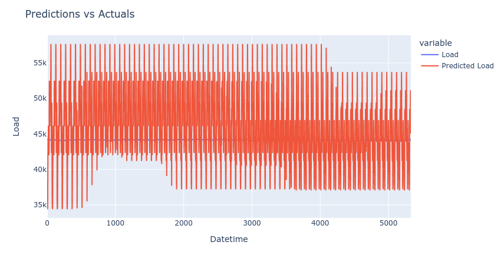

# ERCOT Synthetic Data Generation

This repository contains some experimental code for generating synthetic data for the ERCOT dataset.

I was curious to see if I could use a PyTorch-based transformer model for this task.

 A simple transformer model was implemented to handle the transformation. The model was able to generate data that had similar a similar trend and patterns to the original data, but the range of the synthetic data was considerably larger than the original data.

The best results were generated in the notebook 'transformers_old.ipynb'.

